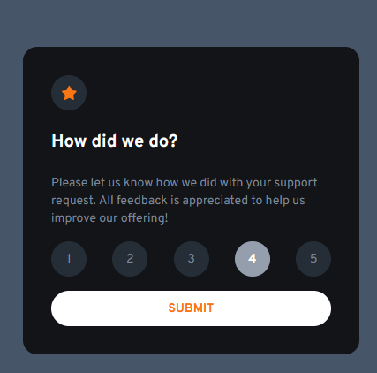

# Frontend Mentor - Rating Component Solution

This is a solution to the [Interactive rating component challenge on Frontend Mentor](https://www.frontendmentor.io/challenges/interactive-rating-component-koxpeBUmI). Frontend Mentor challenges help you improve your coding skills by building realistic projects. 

## Table of contents

- [Overview](#overview)
  - [Screenshot](#screenshot)
  - [Links](#links)
- [My process](#my-process)
  - [Built with](#built-with)
- [Author](#author)

## Overview

### Screenshot

### Links

- Solution URL: [https://fmratingcomponent.vercel.app/](https://fmratingcomponent.vercel.app/)
- Live Site URL: [https://fmratingcomponent.vercel.app/](https://fmratingcomponent.vercel.app/)

## My process

### Built with

- Semantic HTML5 markup
- CSS custom properties
- Flexbox
- Mobile-first workflow
- [React](https://reactjs.org/) - JS library
- [Next.js](https://nextjs.org/) - React framework
- [TailwindCSS](https://tailwindcss.com/) - For styles

## Author

- Frontend Mentor - [@MatiScavuzzo](https://www.frontendmentor.io/profile/MatiScavuzzo)
- Twitter - [@MNScavuzzo](https://twitter.com/MNScavuzzo)